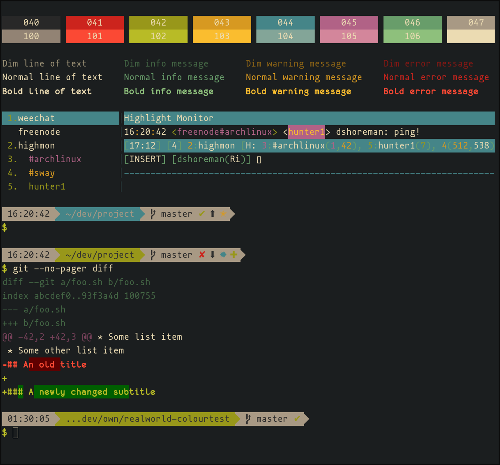

# Real-World Colour Test

I recently switched to Alacritty so once again, I'm on the quest for a new
colour scheme. Plenty of things exist already to test shell colours, but I
couldn't find anything that output any decent "real world" examples...
Hence this script was born.

### What it Outputs

* Colour blocks for the standard 16-colour palette
* Text, info, warning and error messages, each with `dim`, `bold` and `normal` variants
* Dummy Weechat UI
* Two ZSH prompts using the Bullet Train theme
  * One with defaults, and one using colours
    [from my dotfiles](https://github.com/dshoreman/dotfiles/blob/ef5af8ebba772ee2f95cc562e81856efbfb4adf5/stowable/zsh/.zshrc#L8-L9)
* Sample Git diff output with `diff-so-fancy` enabled

### Usage

The easiest way to use this script is to pipe it through Bash:

```sh
curl https://raw.githubusercontent.com/dshoreman/realworld-colourtest/master/colours.sh | bash
```

For a more permanent install, clone this repo and move `colours.sh` to somewhere in your `$PATH`:

```sh
git clone https://github.com/dshoreman/realworld-colourtest.git
sudo cp realworld-colourtest/colours.sh /usr/local/bin/colourtest
```

Assuming your `$PATH` isn't borked, you'll now be able to run `colourtest` from anywhere.

### Preview

[](./preview.png)
